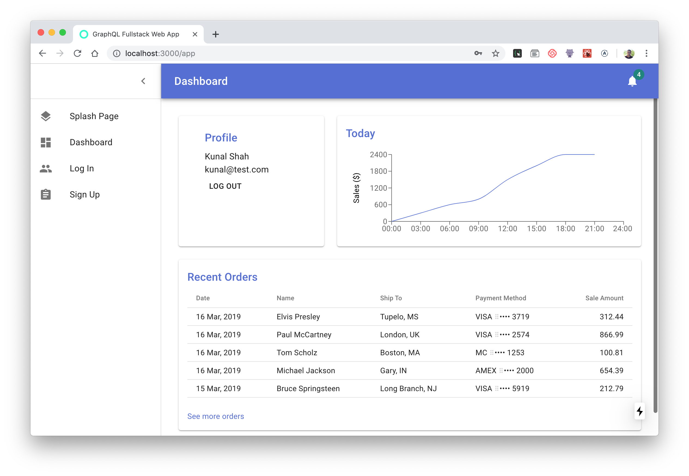

# GraphQL Fullstack Boilerplate

A monorepo web application boilerplate with authentication, a graphQL api, database access, and material-ui styling.

Visit the demo at https://graphql-fullstack.now.sh




# Features

⚡️ Deploy a full-featured production-ready web application in less than 60 seconds.

🔐 Allow users to sign up and log in with an email and password, view their profiles and data, and log out.

📃 Includes a splash page, login page, sign up page, and dashboard.

🤖‍‍ Uses prebuilt commonly-used components, including a sidebar, top navigation bar, animated line graph with [Recharts](http://recharts.org/en-US/), and [Material Icons](https://material.io/resources/icons/).

☁️ [Zero Config Deployments](https://zeit.co/blog/zero-config). It just works 🔥


# Quick Start

Clone the repository

```bash
git clone https://github.com/kunalgorithm/graphql-fullstack
```

install dependencies, then run the development server:

```bash
npm install
npm run dev
```

# Deploy

Deploy to the cloud with [now](https://zeit.co/now) ([download](https://zeit.co/download))

Install the `now` CLI

```bash
npm install --global now
```

Then deploy using

```bash
now
```


# Tech stack

🤖 [Typescript](https://www.typescriptlang.org) - static types, used throughout the client and server (especially handy for the auto-generated prisma2 client).

🌚 [Next 9](https://github.com/zeit/next.js) - server-side rendering, file-based routing in the `pages` directory, and serverless build of of graphql API within `pages/api/graphql.ts` using [API Routes](https://github.com/zeit/next.js#api-routes)

🦋 [Apollo](https://www.apollographql.com/docs/react/hooks-migration/) (React Hooks API) - GraphQL client for queries and mutations.

🦄 [Prisma 2](https://github.com/prisma/prisma2) - Next-generation database access and migration tools. _NOTE: Prisma 2 is currently in the preview phase and is not yet ready for use in production._

💅 [Material UI](https://material-ui.com) - Material UI components, CSS-in-JS styles solutions, and theme.

▲ [ZEIT now](https://now.sh) - serverless monorepo deployment


# Development 

## Create new data types

Add new data fields by using the _lift_, prisma2's built-in database migration tool.

Install the prisma2 CLI

```
npm install -g prisma2
```

Then open `schema.prisma` in the `prisma` directory. Add a new optional field, _githubUrl_ to a data type, _User_.

```
model User {
  id        String  @default(cuid()) @id
  email     String  @unique
  password  String
}
```

becomes

```
model User {
  id         String  @default(cuid()) @id
  email      String  @unique
  password   String
  githubUrl  String?
}
```

Note that `?` signals that the field is optional.

### Run the database migration using [Lift](https://lift.prisma.io/)

Once you've made the change to `schema.prisma`, you'll need to apply the change to the database:
1. Create the migration by running `prisma2 lift save "Added githubUrl to User"` with an appropriate message.
2. Run the migration with `prisma2 lift up`. 
3. Finally, generate a new photon client to accomodate the updated datamodel by running `prisma2 generate`.

### Make it available to the frontend. 

Now that you've added a new field to your database and made it available to the _server_, you need to make it available to your _client_ by defining it within the graphQL endpoint's type definitions.  

Open the API route at `pages/api/graphql.ts` and extend 

```
type User {
  ...
}
```

to 

```
type User {
  ...
  graphqlUrl: String
}
```

## Connect to a production database

The boilerplate uses SQLite in development mode get you up and running as fast as possible, which stores all data in `dev.db`, as configured in `prisma/schema.prisma`:

```
datasource db {
  provider = "sqlite"
  url      = "file:dev.db"
}
```

Before shipping your app, consider creating a MySQL database on [AWS](https://aws.amazon.com) or other managed database provider. Prisma2 also supports Postgres and MongoDB, but the majority of their examples use MySQL, leading me to suspect it may be a more thoroughly tested integration.

Once created, change the datastore value to

```
datasource db {
  provider = "mysql"
  url      = "mysql://YOUR_MYSQL_LINK"
}
```
